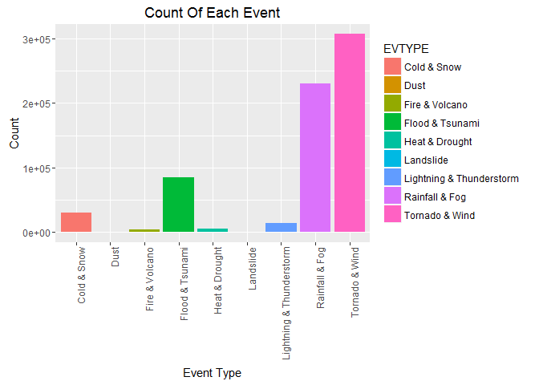
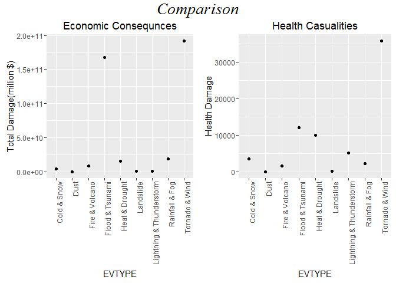

# NOAA Storm Analysis
Nitesh  
3 September 2016  

## 1.Synopsis
This project involves exploring the U.S. National Oceanic and Atmospheric Administration's (NOAA) storm database. This database tracks characteristics of major storms and weather events in the United States, including when and where they occur, as well as estimates of any fatalities, injuries, and property damage. At first the data is downloaded if it is already not present and is then loaded into the workspace. Then the data is analysed for further study. Here two questions have been answered, which types of events are most harmful with respect to population health and which types of events have the greatest economic consequences.


### Loading Required Packages

```r
library(ggplot2)
library(plyr)
library(grid)
library(gridExtra)
```


## 2.Data Processing

### 2.1.Downloading Data

```r
if(!file.exists("repdata%2Fdata%2FStormData.csv.bz2"))
{
    url <- "https://d396qusza40orc.cloudfront.net/repdata%2Fdata%2FStormData.csv.bz2"
    download.file(url,"repdata%2Fdata%2FStormData.csv.bz2")
}
```

### 2.2.Loading Data

```r
StormData <- read.csv("repdata%2Fdata%2FStormData.csv.bz2")
```
### 2.3.Reducing The Dataset
Since the latest years account for most of the data, initial values(25%) are being been removed.


```r
ReducedRows <- 0.25 * nrow(StormData)
StormData <- StormData[ReducedRows:nrow(StormData),]
```

Some columns contain NA values and need to be removed, thus removing those columns


```r
StormData <- StormData[,colSums(is.na(StormData))==0]
```

### 2.4.Refactoring EVTYPE With Similar Names

Determing all the event type


```r
head(unique(StormData$EVTYPE),n = 50)
```

```
##  [1] HAIL                           THUNDERSTORM WINDS            
##  [3] LIGHTNING                      FLASH FLOOD                   
##  [5] HIGH WIND                      THUNDERSTORM WIND             
##  [7] FLASH FLOODING                 TORNADO                       
##  [9] THUNDERSTORM  WINDS            THUNDERSTORM WINDSS           
## [11] TSTM WIND                      HIGH WINDS                    
## [13] DUST DEVIL                     DENSE FOG                     
## [15] FLOOD                          THUNDERSTORM WINDS/HAIL       
## [17] HEAVY SNOW                     HIGH WIND/HEAVY SNOW          
## [19] SOUTHEAST                      FLOOD/FLASH FLOOD             
## [21] THUNDERSTORM WINDS HAIL        ICE                           
## [23] SNOW AND ICE                   SNOW                          
## [25] SNOW/ICE                       HEAVY SNOW & ICE              
## [27] EXCESSIVE HEAT                 FREEZING DRIZZLE AND FREEZING 
## [29] EXTREME COLD                   FREEZING RAIN AND SLEET       
## [31] ICE STORM                      FREEZING RAIN                 
## [33] RIVER FLOODING                 THUNDERSTORM WINDS AND        
## [35] FLOODING                       TSTM WIND 52                  
## [37] HAIL 100                       HAIL/ICY ROADS                
## [39] WIND DAMAGE                    HEAVY RAIN                    
## [41] FLASH FLOOD/HEAVY RAIN         WINDS                         
## [43] URBAN FLOOD                    HEAVY RAIN; URBAN FLOOD WINDS;
## [45] HEAVY PRECIPITATION            HIGH WIND/BLIZZARD            
## [47] TSTM WIND DAMAGE               HIGH WATER                    
## [49] DROUGHT                        FUNNEL CLOUD                  
## 985 Levels:    HIGH SURF ADVISORY  COASTAL FLOOD ... WND
```
It can be seen that there are event out of which many are of similar type and should have fallen under the same category

Hence, renaming event type :


```r
##Converting EVTYPE from factor to character
StormData$EVTYPE <- as.character(StormData$EVTYPE)
StormData[grepl("tornado|gustnado|spout|funnel|whirlwind",StormData$EVTYPE,ignore.case=TRUE),"EVTYPE"] <- "Tornado"
StormData[grepl("wind|storm|wnd|hurricane|typhoon",StormData$EVTYPE,ignore.case=TRUE),"EVTYPE"] <- "Wind"
StormData[grepl("tstm|thunderstorm|lightning|lighting",StormData$EVTYPE,ignore.case=TRUE),"EVTYPE"] <- "Lightning & Thunderstorm"
StormData[grepl("flood|rising water|floooding|surf|blow-out|swells|fld|dam break|seas|high water|tide|tsunami|wave|current|marine|drowning|stream|beach erosin|seiche" , StormData$EVTYPE, ignore.case=TRUE), "EVTYPE"] <- "Flood & Tsunami"
StormData[grepl("dust|saharan" , StormData$EVTYPE, ignore.case=TRUE), "EVTYPE"] <- "Dust"
StormData[grepl("fire|smoke|volcanic" , StormData$EVTYPE, ignore.case=TRUE), "EVTYPE"] <- "Fire & Volcano"
StormData[grepl("cold|cool|ice|icy|frost|freeze|snow|winter|wintry|wintery|blizzard|chill|freezing|avalanche|glaze|sleet|low temperature" , StormData$EVTYPE, ignore.case=TRUE), "EVTYPE"] <- "Cold & Snow"
StormData[grepl("slide|erosion|slump" , StormData$EVTYPE, ignore.case=TRUE), "EVTYPE"] <- "Landslide"
StormData[grepl("warmth|warm|heat|dry|hot|drought|driest|thermia|temperature record|record temperature|record high" , StormData$EVTYPE, ignore.case=TRUE), "EVTYPE"] <- "Heat & Drought"
StormData[grepl("precipitation|shower|rain|hail|drizzle|wet|percip|burst|depression|fog|wall cloud|vog|precip" , StormData$EVTYPE, ignore.case=TRUE), "EVTYPE"] <- "Rainfall & Fog"
```
Removing the events whose type is not known


```r
StormData <- StormData[!grepl("summary|none|other|excessive|floyd|criteria|monthly temperature|mild pattern|no severe weather|southeast|urban small|heavy mix|northern lights|\\?",StormData$EVTYPE,ignore.case = TRUE),]
```

Plot showing count of events occuring


```r
ggplot(data = StormData,aes(EVTYPE,fill = EVTYPE)) + geom_bar() + ggtitle("Count Of Each Event") + xlab("Event Type") + ylab("Count") + theme(axis.text.x = element_text(angle = 90, hjust = 1))
```

<!-- -->

### 2.5.Assigning Proper Values To Required Columns


```r
TenthPower <- function(x)
{
    if(is.numeric(x)) {
      x <- x
    }
    else if(grepl("h", x, ignore.case=TRUE)) {
      x <- 2
    }
    else if(grepl("k", x, ignore.case=TRUE)) {
      x <- 3
    }
    else if(grepl("m", x, ignore.case=TRUE)) {
      x <- 6
    }
    else if(grepl("b", x, ignore.case=TRUE)) {
      x <- 9
    }
    else if(x == "" | x == " "){
      x <- 0
    }
    else{
      x <- NA
    }
    return(x)
}
calculateDamage <- function(num, exponent)
{
    pow <- TenthPower(exponent)
    if(is.numeric(num))
    {
      num <- num * (10 ^ pow)
    }
    if(!is.numeric(num))
    {
      num <- 0
    }
    num
}

StormData$propDamage <- mapply(calculateDamage, StormData$PROPDMG, StormData$PROPDMGEXP)
StormData$cropDamage <- mapply(calculateDamage, StormData$CROPDMG, StormData$CROPDMGEXP)
```

### 2.6.Types of events most harmful to population health


```r
StormData$HealthDamage <- StormData$FATALITIES + StormData$INJURIES
PopulationDamage <- aggregate(HealthDamage ~ EVTYPE,data = StormData,sum)
```


### 2.7.Types of events having the greatest economic consequences


```r
StormData$TotalDamage = StormData$propDamage + StormData$cropDamage
EconomicDamage <- aggregate(TotalDamage ~ EVTYPE,data = StormData,sum)
```

## 3.Results

### 3.1.Tables
Most harmful events to human health arranged in the order to high to low


```r
PopulationDamage[with(PopulationDamage,order(-HealthDamage)),]
```

```
##                     EVTYPE HealthDamage
## 9           Tornado & Wind        35814
## 4          Flood & Tsunami        12120
## 5           Heat & Drought        10021
## 7 Lightning & Thunderstorm         5122
## 1              Cold & Snow         3611
## 8           Rainfall & Fog         2212
## 3           Fire & Volcano         1545
## 6                Landslide           99
## 2                     Dust           41
```

Events with the greatest economic consequences arranged in the order high to low


```r
EconomicDamage[with(EconomicDamage,order(-TotalDamage)),]
```

```
##                     EVTYPE  TotalDamage
## 9           Tornado & Wind 191708892748
## 4          Flood & Tsunami 167480012930
## 8           Rainfall & Fog  19247136715
## 5           Heat & Drought  14977356800
## 3           Fire & Volcano   8164953130
## 1              Cold & Snow   4283326590
## 7 Lightning & Thunderstorm    810270723
## 6                Landslide    347629100
## 2                     Dust       717130
```

### 3.2.Figures
Plot to show that damage to health by the events is different from economic consequences


```r
plot1 <- ggplot(data = EconomicDamage,aes(EVTYPE,TotalDamage)) + geom_point() + ggtitle("Economic Consequnces") + ylab("Total Damage(million $)") +theme(axis.text.x = element_text(angle = 90, hjust = 1))
plot2 <- ggplot(data = PopulationDamage,aes(EVTYPE,HealthDamage)) + geom_point() + ggtitle("Health Casualities") + ylab("Health Damage") + theme(axis.text.x = element_text(angle = 90, hjust = 1))
grid.arrange(plot1,plot2,ncol = 2,top=textGrob("Comparison", gp = gpar(fontsize=20,font=8)))
```

<!-- -->


